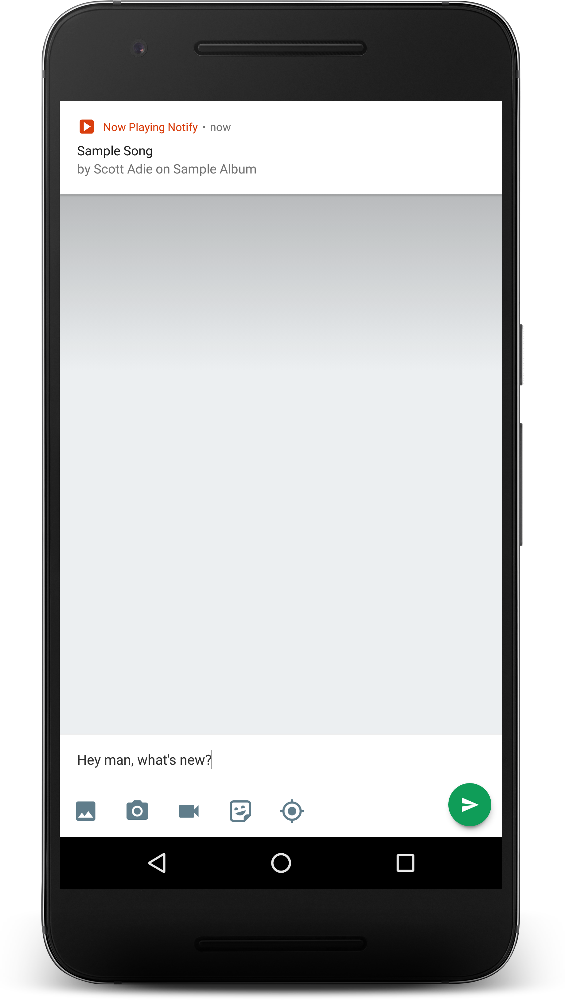
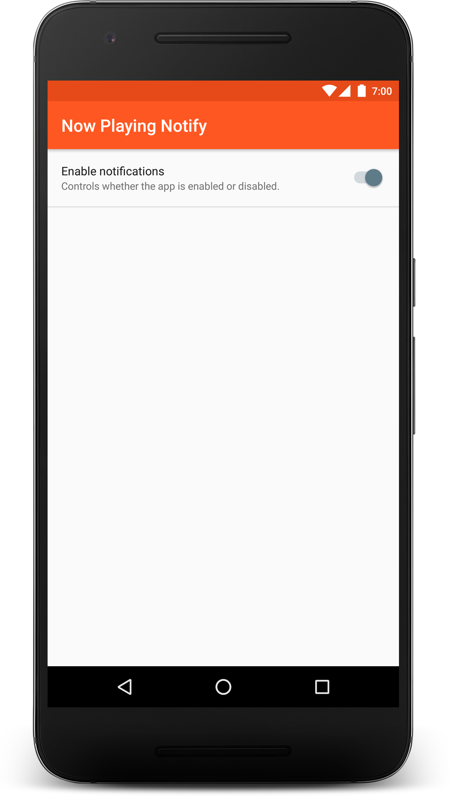

# Now Playing Notify

Now Playing Notify allows your to enable a notification which displays the track information every time it changes. use the Quick Tile to quickly turn on and off the application or access it through the app normally.

 

## Details

The app is implemented uses two services and an activity.

### Activity

The activity provides a simple method to turn on or off the app. Also allows access to the app menu to view open source licenses.

### NowPlayingService

This is the foreground service which holds a reference to the broadcast receiver for song changes. This handles mostly all of the work throughout the app. It exposes a LiveData<Boolean> about whether the app is running or not. The app is considered running if the broadcast receiver is listening for song changes. Inside the broadcast receiver a notification is generated.

### NowPlayingTileService

This service handles the Tile Service features. This allows the tile to sync with the current status of the foreground NowPlayingService. The NowPlayingTileService binds to the NowPlayingService to get a status. When the status updates the tile will update as well. I also implemented a lifecycle owner on this tile service. I couldn't use a LifecycleService because I needed to use a TileService. 

